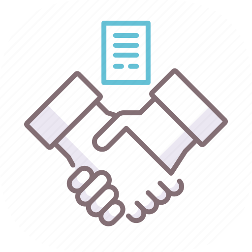

<p align="center">
  <a href="https://github.com/SergeyIvanovDevelop/Social-Contract">
    
  </a>
</p>
<h1 align="center">
  Social Contract
</h1>

## Social-Contract &middot; [](./LICENSE) [](https://www.python.org/) [](https://go.dev/) [](https://github.com/fyne-io/fyne) [](https://www.postgresql.org/) [](https://dnevnik.ru/) [](https://www.linkedin.com/in/sergey-ivanov-33413823a/) [](https://t.me/SergeyIvanov_dev) ##

This repository contains code and configuration files for deploying the `Social-Contract` platform, which provides children and parents with the ability to enter into a "social contract" that allows financial incentives for a child's success in school.

## :gear: How it works  ##

1. Parent and child need to register in `Social-Contract` platform via `Desktop GUI Application`. There, the parent enters their data, the child's data (including the _open_ data of the child's bank card) and the data for entering the electronic diary platform [Dnevnik.ru](https://dnevnik.ru/) - so that the platform can track the child's grades. During the registration process, the policy for calculating material incentives for grades is also selected.

2. After registration on the platform is completed, the parent subscribes to the `Telegram` bot, enters the necessary identification data, and subsequently, at his request, the bot will generate a `QR` code for payment in a mobile bank (_tested in the bank [Tinkoff bank](https://www.tinkoff.ru/)_) for a parent in accordance with the financial incentive policies described in the contract.

3. The general scheme of the platform is shown in the image: <br>

<p align="center">

</p>

## :computer: Getting Started  ##

**Step 1**

1. Go to home directory and clone repository from github: `cd ~ && git clone https://SergeyIvanovDevelop@github.com/SergeyIvanovDevelop/Social-Contract`

**Step 2**<br>

2. Go to the directory of the downloaded repository: `cd ~/Social-Contract`

**Step 3**<br>

3. Installing dependencies for the `PostgreSQL` DBMS, creating a new user and creating a database on his behalf and deploying it (tables, mappings, etc.), as well as installing dependencies for `Python` scripts: 

```
cd Backend/PostgreSQL && ./deploy.sh
```

**Step 4**<br>

4. Install [Golang](https://go.dev/) and the library for building `GUI` applications [fyne](https://github.com/fyne-io/fyne)


**Step 5**<br>

5. Enter the required personal details in the source code in the files:
- [config.json](./Backend/PostgreSQL/config.json):
```
	- "subnet":"<IP-address>/32" ---> bash: $ ip a
	- "database":"<db_name>",
	- "user":{
                "name":"<db_user_name>",
                "password":"<db_user_password>"
            }
	- "token":"<telegram_bot_token>"
```
- [main.go](./Backend/main.go):
```
	- DB_USER     = "<db_user_name>"
	- DB_PASSWORD = "<db_user_password>"
	- DB_NAME     = "<db_name>"
```

**Step 6**<br>

6. Build and run the `backend` part of the platform: `cd ~/Social-Contract/Backend && go build -o ./main && ./main <backend-part-port>`

**Step 7**<br>

7. Build and run the `frontend` part of the platform: `cd ~/Social-Contract/GUI_funy_lib && go build -o ./main && ./main <IP-address of backend-part> <backend-part-port>`

**Step 8**<br>

8. Run `Telegram` bot: `cd ~/Social-Contract/Python_modules && bot.py`

*Note: The login of the user that the bot requests is calculated according to the rule: "LOGIN_"+Child's name+"_"+"Child's last name"+"_"+"Parent's login". Example:
Parent login: login_1
Child's name: Ivan
Child's last name: San

----> Child login: LOGIN_Ivan_San_login_1_*


**:framed_picture: Illustrations:**<br>

This illustrations demonstrates using the `desktop GUI application` of `Social-Contract` platform.<br>

<p align="center">

</p>

<p align="center">

</p>

<p align="center">


</p>

<p align="center">


</p>

<p align="center">

</p>

<p align="center">

</p>

<p align="center">

</p>

**:clapper: Example using (GIF):**<br>

This animation demonstrates scenarios for using the `Telegram`-bot of `Social-Contract` platform.<br>

<p align="center">
  
</p>

### :bookmark_tabs: Licence ###
Social-Contract is [CC BY-NC-SA 3.0 licensed](./LICENSE).
